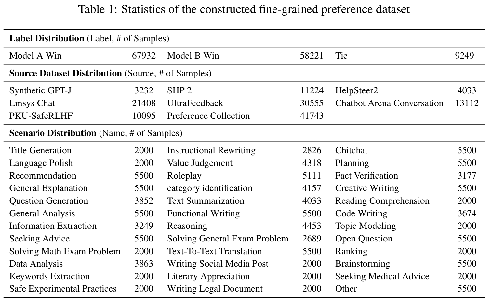

<div align="center">

<h1 align="center"> SaMer: A Scenario-aware Multi-Dimensional Evaluation for Large Language Models </h1>

<p align="center">
  <a href="./">📖 Paper</a> •
  <a href="https://drive.google.com/file/d/1jyZg-SfLVSjWE4G7sic-3VN_g62qK51l/view?usp=sharing">🤖 Model</a> •
  <a href="./data/">🤗 Dataset</a>
</p>

<div align=center></div>

<p></p>
</div>

**SaMer** is a cutting-edge LLM Judge designed for assessing the quality of large language model (LLM) outputs. Unlike traditional evaluators with fixed dimensions, SaMer dynamically identifies and prioritizes relevant evaluation criteria based on the query context. By leveraging a large-scale dataset of fine-grained preferences across diverse scenarios, it provides interpretable, multi-dimensional evaluations, balancing both overall and detailed scoring. SaMer's flexibility and robustness make it a versatile tool for improving LLM performance in various real-world applications.

<h3 id="3.1">⬇️ Step 1: Installation</h3>

To train or inference SaMer, first clone the repository;

Next, set up a conda environment to manage the dependencies:
```bash
conda create -n samer python=3.10.9
conda activate samer
```
Then, install the required dependencies:
```bash
pip install -r requirements.txt
```

<h3 id="3.2">🚀 Quickly Start </h3>

We encourage users to use `SaMerPipeline` to quickly inference:

```python
from inference import SaMerPipeline

pipeline = SaMerPipeline(model_id="YOUR_MODEL_PATH")

# inference using the following data format:
chat_messages = [
    {"role": "user", "content": "Stephen has 2 apples. Yesterday he had 1 apple. How many apples does he have today?"},
    {"role": "assistant", "content": "Stephen has 2 apples today."}
]
result = pipeline(chat_messages)
selected_dims_name = result['evaluation_dim'] # the name of the selected dimensions
dimensional_score = result['dimensional_score'] # the score of 42 dimensions
overall_score = result['overall_score'] # the overall score (a scale from 0 to 1)
```

If you need to train using SaMer's format, first construct the training data according to the data format in `data/train/seeds.json`. Then, use the following command to train:

```bash
bash train.sh   # For better training, you need to adjust some parameters in the file.
```

<h3 id="3.3">📜 Tips </h3>

1. The train data examples lie in the `data/train/seeds.json` file.
2. The MD-Eval Benchmark is available at `data/benchmark/MD-Eval`.
3. The description of each dimension in each scenario can be found in the `utils/prompt/metrics.yaml`.
3. The OOD data we used to evaluate the dimension selection performance of SaMer and baselines lies in `data/benchmark/OOD`.
4. The details of why SaMer can outperform GPT-4o on Vicuna Bench can be found in the `other_resources/SaMer_vs_gpt4o_vicunabench`.
5. `SaMer-llama3-8B` checkpoint is available [here](https://drive.google.com/file/d/1jyZg-SfLVSjWE4G7sic-3VN_g62qK51l/view?usp=sharing).

<h3 id="3.4"> 📖 Data Construction </h3>

